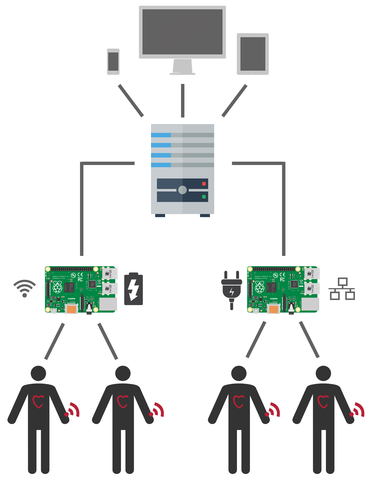

# Introduction


### Carduino - Réseaux de capteurs communiquants

Carduino est le fruit d'un projet d'étudiants ingénieurs de l'[ESTIA](http://www.estia.fr) (École Supérieure des Technologie Industrielles Avancées). Il s'agit d'un démonstrateur, témoin du savoir-faire et des compétences des étudiants et des enseignants de l'ESTIA en matière d'éléctronique, d'informatique et de systèmes embarqués. Au delà de cela, il a été conçu de manière à pouvoir être facilement re-utilisé, et modifié, pour prendre part à de futures activités pédagogiques (TP, cours) et de recherche (capteurs autonomes, énergie, collecte de données).

Le projet se décompose en 3 sous systèmes distincs. Le serveur, les concentrateurs, et les capteurs. Cette documentation détaille le fonctionnement logiciel du serveur et des concentrateurs.


# Prérequis

Cette section détaille l'ensemble des technologies/librairies utilisées. La suite de la documentation

## Système d'exploitation


L'ensemble du système informatique à été développé pour une utilisation optimale sur des systèmes Linux (Debian pour le serveur et Raspian pour les concentrateurs).
Néanmoins,

Il est possible, sans portage particulier, de lancer le serveur sur la plus part des système Linux (Debian, Ubuntu, Fedora, etc), ainsi que d'autres systèmes UNIX comme Mac-OSX ou FreeBSD. Il est théoriquement possible de lancer le serveur sur des plateformes Windows, mais certaines dépendances et parties de code spécifiques devront êtres portés.

Concernant les concentrateurs, Il est possible d'utiliser différentes distributions de Linux, mais la partie concernant l'acquisition des données (les communications via le GPIO du Raspberry Pi) devra certainement être adaptée.

À l'heure actuel, Raspbian se base sur la dernière version de Debian (version 8 / Debian Jessie). Les OS de tous le système carduino font donc preuve d'une certaine unité qui facilite le travail.


## terminal SSH

> Connexion SSH vers un serveur :

```bash
	ssh -p 'port du serveur' 'utilisateur'@'IP ou ndd'
```

> Déconnexion : **`Ctrl + d`**


L'installation/configuration/lancement de tout le système se fait quasi-systématiquement via SSH.

Il faut donc disposer d'un terminal permettant d'établir une connexion SSH sur la machine utilisée pour installer/configurer/lancer le système Cardiuno. C'est le cas de tous les Linux et de Mac-OSX. Pour windows, il faudra passer par un logiciel comme `PuTTY`, ou d'une machine virtuelle Linux pour disposer d'un terminal performant.


## Node.JS - Javascript ES-2016


Javascript est le language principal du système. Sa compréhension est indispensable pour comprendre/modifier le système carduino. Il à l'avantage de ne pas nécessiter de compilation, d'être cross-platform, facile à apprendre, multi-paradigme, de plus en plus populaire, de disposer nativement de fonctionnalités réseau avancées, de fédérer une grande communauté de programmeurs, et d'être un des languages de script les plus rapides.

La partie Client du système fait également un usage intensif de Javascript, on peut donc parler de système full-stack Javascript.


## MongoDB - Mongoose ORM


L'ensemble des données amassées par le réseau de capteur est stocké sur une base de donnée No-SQL MongoDB.
Cette base de donnée est :
Orientée documents
Rapide
Manipule des Objets JSON/BSON
Hautement scalable
Souple d'utilisation
Adaptée aux infrastuctures complexes (Clouds, Shards, Replica-sets, etc.)
Adaptée a de grandes quantitées de données.

L'accès à cette base de donnée au sein du serveur sera fait via l'ORM Mongoose, permettant d'établir des modèles et de structurer les données.
Pour un accès direct à la base de donnée, il est recommandé d'utiliser des clients comme MongoChef, MongoHub ou RoboMongo.


## Express.js - Connect.js

Express.js, basé sur connect, est le framework de base utilisé par le serveur Carduino.
Il permet de gérer les communications, les routes (urls / API RESTFull) du serveur, l'authentification, etc.
Il fonctionne grâce à un enchainnement de middlewares.


## Feathers.js


Feathers.js est une couche d'abstraction au dessus d'express, qui permet la mise en place de services avec un accès commun via une API REST ainsi qu'une API temps-réel (dans notre cas via socket.io).
Notre api n'est donc déclarée qu'une fois dans le code source, et permet par exemple de réaliser des opérations BDD et de s'authentifier grace a des méchanismes commun, puis de répondre au client via le bon canal de communication automatiquement.


## Socket.IO - Websockets


En plus de l'API RESTFull, le serveur dispose également d'une API temps réelle réactive (système de Push) via websockets. Socket.IO est la librairie permettant de gérer les websockets, d'établir des rooms, et de gérer les connexions/reconnexion.


## Jade - HTML5

L'interface web se base sur du HTML5. Il sera généré côté serveur grace au pré-processeur/Moteur de template JADE, dont la syntaxe épurée se base sur l'indentation (syntaxe type HAML).


## Stylus - CSS3

La mise en forme de l'interface web se base sur CSS3. Il sera généré coté serveur  grace au pré-processeur Stylus, dont la syntaxe épurée se base sur l'indentation (syntaxe type SASS/SCSS améliorée).


# Architecture


## Architecture globale




## Architecture du serveur


## Architecture des Concentrateurs


# Installation du serveur
## Debian Jessie
### Téléchargement de l'image de Debian

1. [Télécharger l'image iso de Debian Jessie (8.3)](http://cdimage.debian.org/debian-cd/8.3.0/amd64/iso-cd/debian-8.3.0-amd64-netinst.iso)
2. Lancer l'image iso et suivre le processus d'installation.
3. Mettre le système à jour.
3. Activer la connexion SSH si elle n'est pas déjà activée
4. Installer Vim s'il n'est pas présent

<aside class="warning">Pensez à bien noter le mot de passe root du système !</aside>


## Installation de Git
> mise à jour de la liste des packages puis Installation de Git avec apt-get

```bash
	sudo apt-get update
	sudo apt-get install git-core
```
Installation de Git via apt-get.
Assurez vous que la liste des packages du système est bien à jour, puis installez Git.

<aside class="notice">Git est nécessaire pour l'installation, la gestion de version, et le déploiement des mises à jour du serveur Carduino.</aside>


## Configuration minimale de Git
> Définir le username de Git

```bash
	git config --global user.name "Vôtre nom"
```
>Définir l'email de Git

```bash
	git config --global user.email sammy@example.com
```
Git implémente la gestion de version à partir de deux paramètres pricipaux.

Ces informations se retrouveront dans chaque commit que vous ferez avec Git, qui pourra donc identifier qui a fait quels commits.

<br />

Paramètre | Description
--------- | -----------
user.name | Un nom d'utilisateur
user.email | L'email de l'utilisateur


## Installation de MongoDB
>Ajouter les keys MongoDB pour que le système reconnaisse les packages signés par MongoDB et leur fasse confiance.

```bash
	sudo apt-key adv --keyserver keyserver.ubuntu.com --recv 7F0CEB10  
```

>Ajout de leur dépot aux sources du système.

```bash
	echo "deb http://repo.mongodb.org/apt/debian wheezy/mongodb-org/3.2 main" | sudo tee /etc/apt/sources.list.d/mongodb-org-3.0.list
```

> mise à jour de la liste des packages puis Installation de MongoDB avec apt-get

```bash
	sudo apt-get update
	sudo apt-get install mongodb-org -y
```
Installation en utilisant le dépot apt MongoDB.

Cette méthode permet au système de recevoir la dernière version de MongoDB considérée stable par la team MongoDB.

Si vous voulez supprimer le dépot Mongo DB des sources de votre système par la suite, supprimer simplement le fichier suivant :
`/etc/apt/sources.list.d/mongodb-org-3.0.list`


## Configuration de MongoDB
<aside class="warning">Attention, la configuration de MongoDB est une étape cruciale et très sensible !</aside>


## Node.js
### Installation de Curl
### Installation de Node.js


## Carduino
### Clonage du repository
### Installation
### Lancement

# Installation concentrateur
## Raspbian
## Git
## Node.js
## Carduino


# Configuration


# Authentification


# Interface Web


# API Serveur


# API Concentrateur
